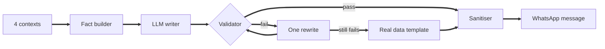

# Vera Next

**An AI WhatsApp copilot that writes messages merchants actually reply to**

Built for the magicpin AI Challenge

**[Live bot](https://vera-next-bot.onrender.com/v1/healthz)** &nbsp;·&nbsp; **[API docs](https://vera-next-bot.onrender.com/docs)**

 

## What it does

Vera reads four pieces of context (the category, the merchant, what just happened, and optionally a customer) and writes **one sharp WhatsApp message** with a real number, the right tone, and a single clear ask. Then it handles whatever comes back: auto replies, "yes do it", "call me later", and everything in between.

## How it works

| | |
|:--|:--|
| **Facts first** | Python does all the maths (peer gaps, trends, matched offers). The model only picks and writes, so it never invents a number. |
| **25 trigger routes** | A compliance deadline, a festival and a lapsed customer each get their own framing, tone and call to action. |
| **Fabrication guard** | Any number, price or date not in the context gets rejected. One rewrite, then a template built from the merchant's real data. |
| **Human voice** | No robotic phrasing. Hinglish only when the merchant actually speaks Hindi, and then the whole message is Hinglish. |
| **Reply brain** | Spots auto replies, jumps straight to action on a "yes", backs off on "later", and exits politely after 3 unanswered nudges. |
| **Never breaks** | Hard time limits on every endpoint, a model fallback chain and a response cache. No timeouts, no server errors, ever. |

## Endpoints

| Route | What it does |
|:--|:--|
| `POST /v1/context` | Store or update a context (versioned) |
| `POST /v1/tick` | Decide who to message right now, and write it |
| `POST /v1/reply` | Handle the merchant's or customer's reply |
| `GET /v1/healthz` | Health and live stats |
| `GET /v1/metadata` | Team and approach info |

## Tradeoffs

**Regex over an LLM for replies.** Instant and predictable, but it can miss unusual phrasing. 
**No embeddings.** With five categories, direct matching was faster and never cited the wrong item. 
**Restraint over volume.** One message per merchant per tick, because spamming kills reply rates. 
**URLs banned entirely.** The testing brief penalises them, so we follow the stricter rule.

## What would make it smarter

Which past messages actually got replies, live slot and stock availability, a sample of how the merchant really types, and offer redemption data.

## Run it locally

1. Install everything in `requirements.txt`
2. Copy `.env.example` to `.env` and add your `GROQ_API_KEY`
3. Start the server with uvicorn on `bot:app`, host `0.0.0.0`, port `8080`, one worker
4. Run `python selftest.py` for 174 checks (no API key needed)
5. Run `python make_submission.py` to build `submission.jsonl`

## Project map

| File | Role |
|:--|:--|
| `bot.py` | Server, endpoints, state |
| `composer.py` | Facts, routing, prompts, validation |
| `sanitizer.py` | Keeps every message human sounding |
| `conversation_handlers.py` | Reply state machine |
| `llm.py` | Providers, rate limiting, cache |

 

Made by **Kush Verma** · JIIT Noida

